# [Project2: Toolbox Functions](https://github.com/CIS700-Procedural-Graphics/Project2-Toolbox-Functions)

Find the final product at: https://tabathah.github.io/Project2-Toolbox-Functions/

## Overview

I procedurally created an animated wing of a parrot.

Here are some reference images I started out with:

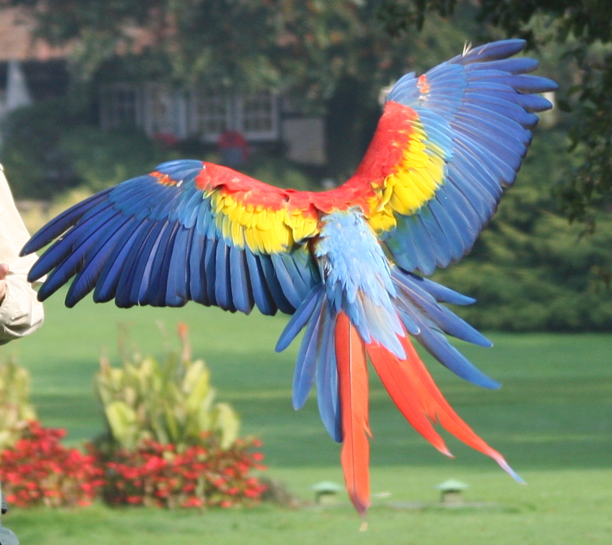

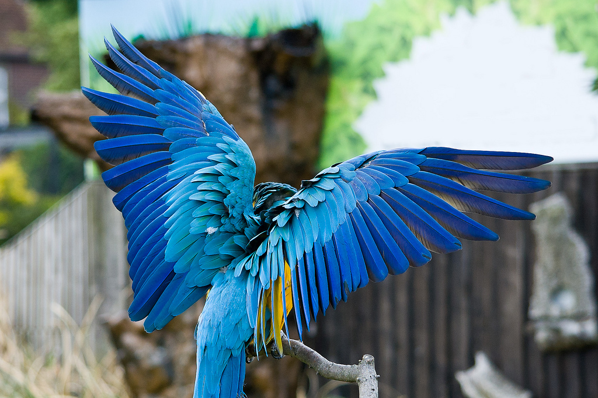

## Model

I was given this basic model of a feather:

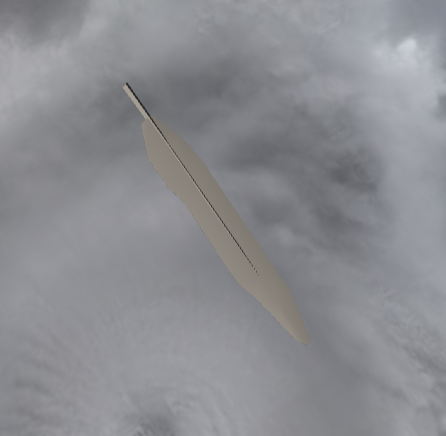

The first thing I did was create a curve that would outline the basic shape of the wing. Here is my curve displayed as a tube geometry so I could see and work on it:

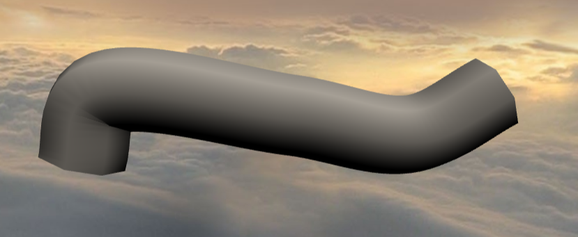

The next thing I did was evenly distribute feathers along the positions on the curve:

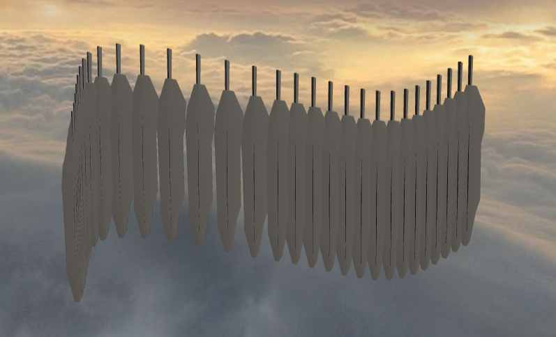

I then began scaling the feathers. To do this, I simply interpolated between the size I wanted the left most feather to have and the size I wanted the right most feather to have. To make this more realistic, I incorporated bias and gain to make the transition less linear. The bias on the scale favored the left feathers so that the left most feathers would be noticably larger than the rest. Also, the gain favored the middle of the feather distribution, so there would be many feathers of the same size in the middle. The result was the following:

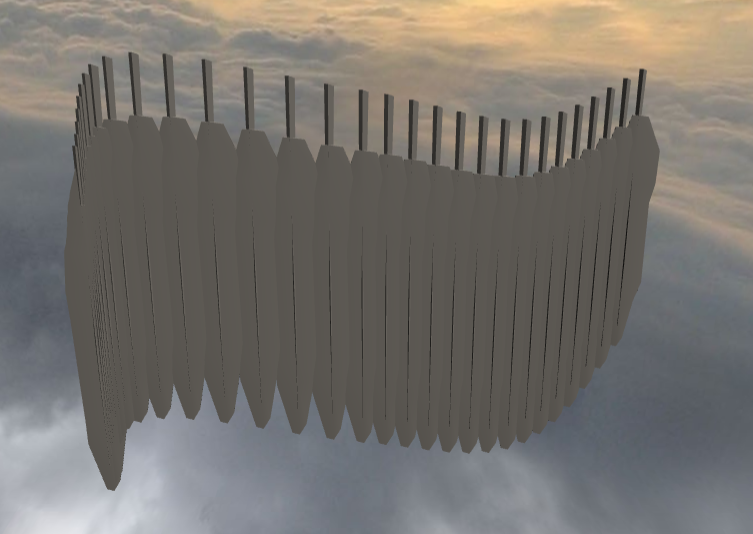

After doing this, I realized I wanted three layers of feathers on my wing to provide added realism. I made two more layers of feathers, displacing there depth by a bit to separate them from other layers, with limited positions on the wing curve and different ranges of scale from the first layer. This gave the following result:

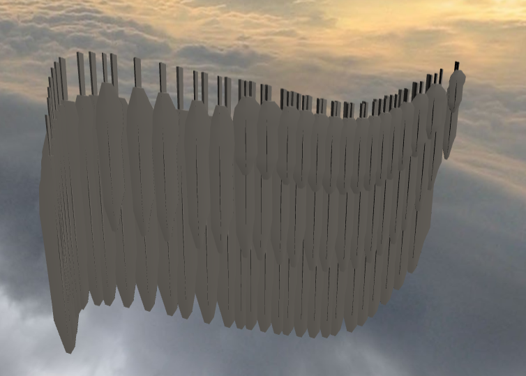

The last thing to do in the modeling was to interpolate rotation of the feathers. The left most feathers had a sharp angle to the left in comparison to the rest and the right most feathers had a slight angle to the right. I provided similar bias and gain in this interpolation to the scaling one because again I wanted the left-most feathers to stand out from the rest and I wanted the middle ones to be pretty uniform. This addition provided the following result:

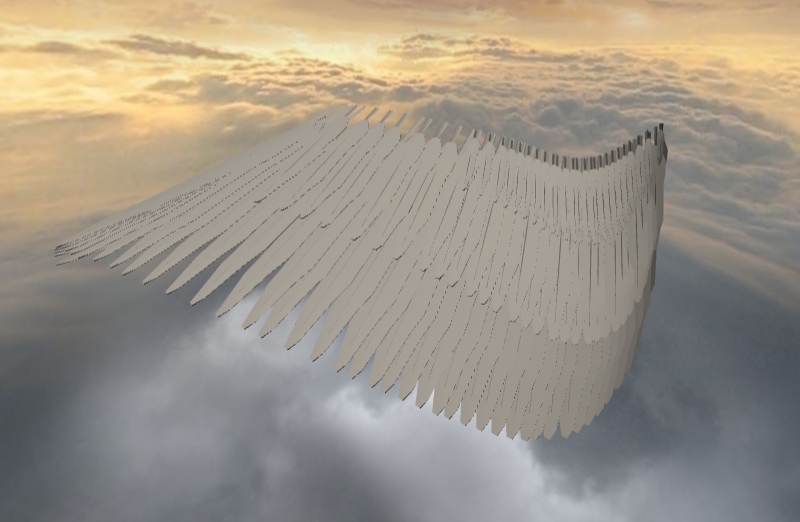

Finally, I added color to the feathers. I created my own shaders which took into account the index of each feather for interpolating and deciding on color based on layer, as well as the light position in the scene and an integer indicating the color pallete. First I started with a flat shader, that merely chose color based on the layer the feather was on. 

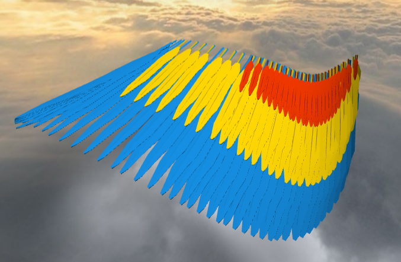

I then added lamertian shading and iridescence, as well as changing the colors I was interpolating in order to make the colors more realistic.

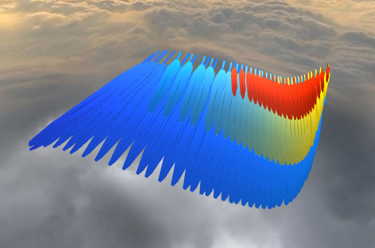

## Animation

I animated the wing so that it would flap at a certain speed and so that the feathers would be affected by a theoretical wind with a speed and a direction. 

The flapping part of the animation was simply a rotation about the x-axis that is linearly interpolated to create the continuous motion. 

I applied the wind by adding a rotation to each feather that was based on the angle of the wind direction and a simple pseudo-noise value based on the feather's index. This noise value was limited based on the speed of the wind, where low speed caused the noise to be very limited and high speed caused the noise to be unlimited. The following is a shot of the wing while high wind speed is on and feathers are being displaced.

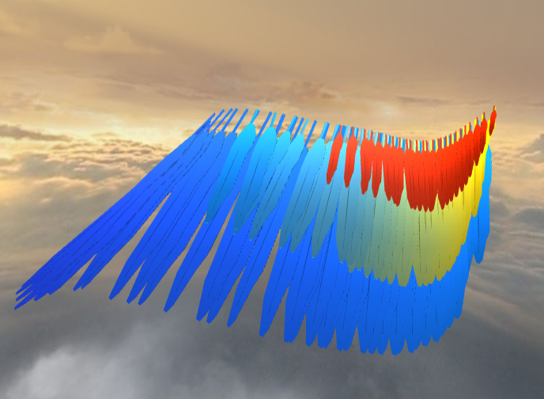  

## Interactivity

I added several sliders on the GUI to change the parameters of the wing for this project. Some pictures have been added for particularly interesting changes that can occur. 

The curvature one affects the y positions of the original curve the wing is based on, so that increasing curvature creates a bendy wing and decreasing it make the wing more flat.

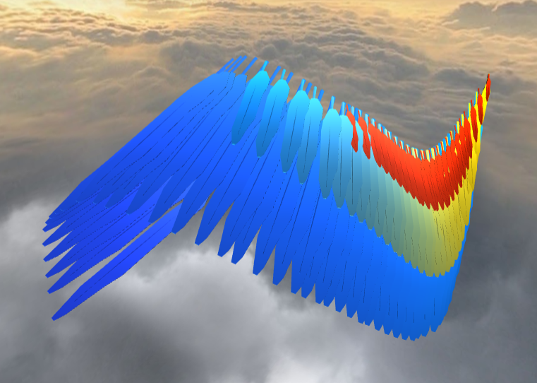 

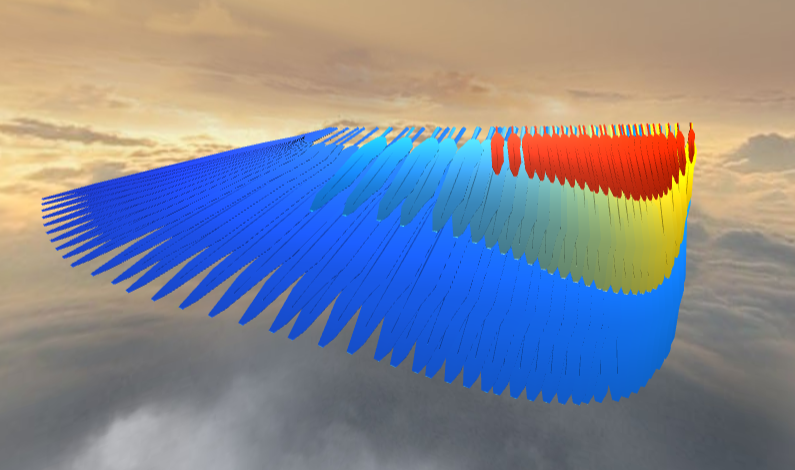

The feather distribution one affects the bias of the position interpolation, so that the more it varies from 0.5, the more the featehrs shift to one side or the other. 

Feather size affects the scale of the feathers in a fairly straightforawrd way. 

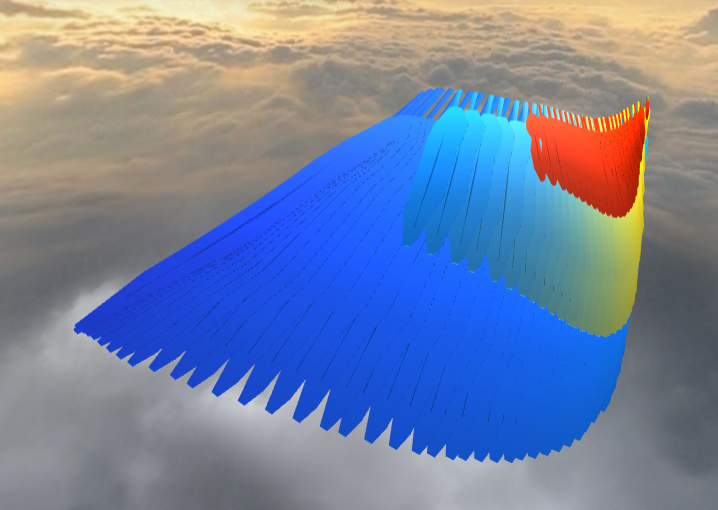 

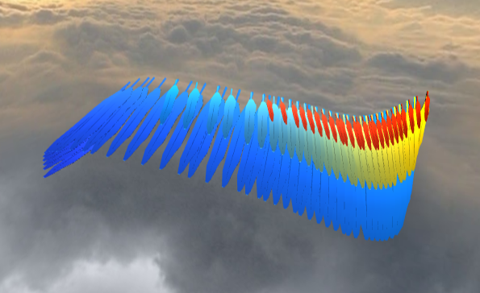

Feather orientation affects the angle of the feathers, again in a pretty strightforward way. 

If the color slider is less than 1.5, the color palette is the default red, yellow, blue, whereas if its over 1.5, the color palette is a purple, blue, and turquoise palette. Below is the second color palette.

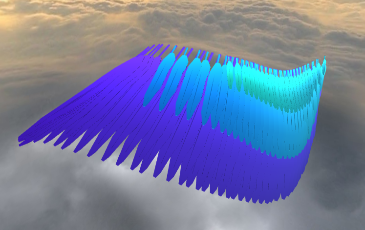 

Wind speed affects the amount of noise that can be placed on feathers during the wind animation, so higher speed creates a more violent wind displacement, and lower speed creates soft vibrations.

Flap Speed affects the period of time during which one up and down motion of the wind occurs. 

Finally, wind direction affects the angle on which the wind is blowing, where 0 is coming straight down onto the wing, 90 is blowing from the right side of the screen, and -90 is blowing from the left side of the screen.

   

## Overview

The objective of this assignment is to procedurally model and animate a bird wing. Let's get creative!

Start by forking and then cloning [this repository](https://github.com/CIS700-Procedural-Graphics/Project2-Toolbox-Functions)

## Modeling

##### Reference images

Search for three or more images of a bird wing (or any flying creature, really) in order to provide yourself reference material, as you're going to base your modeling and animation from these images. For the more artistic minds, feel free to sketch your own concept.

##### Make wing curve

Begin with a 3D curve for your basic wing shape. Three.js provides classes to create many different types of curves, so you may use whatever type of curve you prefer.

##### Distribute feathers

We have provided a simple feather model from which to begin. You are not required to use this model if you have others that you prefer. From this base, you must duplicate the feather to model a complete wing, and your wing should consist of at least thirty feathers. Distribute points along the curve you created previously; you will append the feather primitives to the curve at these points. Make sure that you modify the size, orientation, and color of your feathers depending on their location on the wing. 

Feel free to diversify your wings by using multiple base feather models.

## Animation

Add a wind force to your scene, and parameterize its direction and speed. You will use this wind force to animate the feathers of your wing by vibrating them slightly. Using Dat.GUI, allow the user to modify these wind parameters. Please note that we don't care about your feather motion being physically accurate, as long as it looks nice.

Additionally, animate the control points of your wing curve to make the wing flap, and allow the user to control the speed of the wing flapping.

## Interactivity

Using Dat.GUI and the examples provided in the reference code, allow the user to adjust the following controls:

1. The curvature of the wing's basic shape
2. Feather distribution
3. Feather size
4. Feather color
5. Feather orientation
6. Flapping speed
7. Flapping motion

## For the Overachievers

Suggestions:
- Make a pretty iridescent or otherwise feather appropriate shader.
- Otherwise, going the extra mile for this assignment is really in the polish!

## Submission

- Create a folder called `references` to include your reference images.

- Update `README.md` to contain a solid description of your project

- Publish your project to gh-pages. `npm run deploy`. It should now be visible at http://username.github.io/repo-name

- Create a [pull request](https://help.github.com/articles/creating-a-pull-request/) to this repository, and in the comment, include a link to your published project.

- Submit the link to your pull request on Canvas.

## Getting Started

1. [Install Node.js](https://nodejs.org/en/download/). Node.js is a JavaScript runtime. It basically allows you to run JavaScript when not in a browser. For our purposes, this is not necessary. The important part is that with it comes `npm`, the Node Package Manager. This allows us to easily declare and install external dependencies such as [three.js](https://threejs.org/), [dat.GUI](https://workshop.chromeexperiments.com/examples/gui/#1--Basic-Usage), and [glMatrix](http://glmatrix.net/). Some other packages we'll be using make it significantly easier to develop your code and create modules for better code reuse and clarity. These tools make it _signficantly_ easier to write code in multiple `.js` files without globally defining everything.

2. Fork and clone your repository.

3. In the root directory of your project, run `npm install`. This will download all of those dependencies.

4. Do either of the following (but I highly recommend the first one for reasons I will explain later).

    a. Run `npm start` and then go to `localhost:7000` in your web browser

    b. Run `npm run build` and then go open `index.html` in your web browser

    You should hopefully see the framework code with a 3D cube at the center of the screen!

## Developing Your Code
All of the JavaScript code is living inside the `src` directory. The main file that gets executed when you load the page as you may have guessed is `main.js`. Here, you can make any changes you want, import functions from other files, etc. The reason that I highly suggest you build your project with `npm start` is that doing so will start a process that watches for any changes you make to your code. If it detects anything, it'll automagically rebuild your project and then refresh your browser window for you. Wow. That's cool. If you do it the other way, you'll need to run `npm build` and then refresh your page every time you want to test something.

## Publishing Your Code
We highly suggest that you put your code on GitHub. One of the reasons we chose to make this course using JavaScript is that the Web is highly accessible and making your awesome work public and visible can be a huge benefit when you're looking to score a job or internship. To aid you in this process, running `npm run deploy` will automatically build your project and push it to `gh-pages` where it will be visible at `username.github.io/repo-name`.